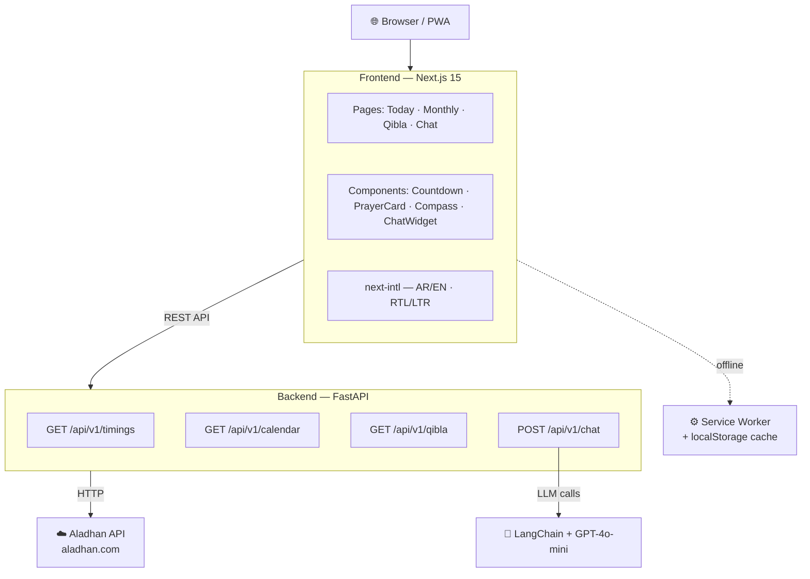

# 🕌 AdhanAgent — وكيل الأذان

<div align="center">

**مواقيت الصلاة والقبلة بين يديك — Prayer times, Qibla & AI assistant**

[](https://github.com/AhmadALshourah/AdhanAgent/actions/workflows/ci.yml)


</div>

---

## ✨ الميزات (Features)

| الميزة | التفاصيل |
|--------|----------|
| 🕐 **مواقيت اليوم** | يكشف موقعك تلقائيًا أو تبحث بالمدينة |
| 📅 **العرض الشهري** | جدول شامل بالتاريخ الهجري والميلادي |
| 🧭 **اتجاه القبلة** | بوصلة تفاعلية بـ Framer Motion |
| ⏳ **عدّاد تنازلي** | يُحدَّث كل ثانية، أرقام عربية في العربية |
| 🔔 **إشعارات الصلاة** | Notification API + صوت أذان بـ Web Audio |
| 🤖 **مساعد AI** | وكيل LangChain + GPT-4o-mini للدردشة |
| 🌙 **Dark / Light** | يحترم تفضيل النظام، يُحفظ في localStorage |
| 🌐 **عربي + إنجليزي** | RTL/LTR تلقائي، أرقام محلّية، تواريخ هجرية |
| 📱 **PWA** | قابل للتثبيت، Service Worker، offline cache |

---

## 🏗️ المعمارية (Architecture)



---

## 🛠️ التقنيات (Tech Stack)

**Backend**
- Python 3.12 · FastAPI · uvicorn · httpx (async) · pydantic v2
- LangChain 0.3 · langchain-openai (GPT-4o-mini)
- pytest · respx · ruff

**Frontend**
- Next.js 15 (App Router) · TypeScript · Tailwind CSS
- next-intl · Framer Motion · TanStack Query · lucide-react
- Web Audio API · Notification API · Service Worker

---

## 🚀 التشغيل المحلي (Local Setup)

### المتطلبات (Requirements)
- Python 3.12 + [`uv`](https://github.com/astral-sh/uv)
- Node.js 22+

### Backend

```bash
cd backend

# Create venv with Python 3.12
python -m uv venv --python 3.12 .venv

# Install deps
python -m uv pip install --python .venv/Scripts/python.exe -r requirements.txt

# Copy env file and add your OpenAI key
cp .env.example .env
# edit .env → set OPENAI_API_KEY=sk-...

# Run
PYTHONPATH=$(pwd) .venv/Scripts/python -m uvicorn app.main:app --reload
# → http://localhost:8000/docs
```

### Frontend

```bash
cd frontend
npm install

# Copy env
cp .env.example .env.local
# NEXT_PUBLIC_BACKEND_URL=http://127.0.0.1:8000

npm run dev
# → http://localhost:3000
```

### Docker (كل شيء معًا)

```bash
docker compose up --build
# Frontend → :3000 · Backend → :8000
```

---

## ✅ الاختبارات (Tests)

```bash
# Backend
cd backend
PYTHONPATH=$(pwd) python -m pytest tests/ -v

# Frontend build + lint
cd frontend
npm run build && npm run lint
```

---

## 📁 هيكل المشروع (Project Structure)

```
AdhanAgent/
├── backend/
│   ├── app/
│   │   ├── api/v1/         # FastAPI routers (timings, calendar, qibla, chat)
│   │   ├── core/           # cache, error handlers
│   │   ├── schemas/        # Pydantic models
│   │   ├── services/       # Aladhan client + LangChain agent
│   │   ├── main.py         # App factory + CORS
│   │   └── settings.py     # pydantic-settings
│   └── tests/              # pytest + respx mocks
├── frontend/
│   ├── src/
│   │   ├── app/[locale]/   # Next.js App Router (ar / en)
│   │   ├── components/     # UI components
│   │   └── lib/            # API client, hooks, utils
│   ├── messages/           # ar.json · en.json
│   └── public/             # manifest.webmanifest · sw.js · icons/
├── .github/workflows/      # CI pipeline
├── docker-compose.yml
└── phase.md                # Development roadmap
```

---

## 🌐 النشر (Deployment)

| الخدمة | المنصّة | الرابط |
|--------|---------|--------|
| Frontend | [Vercel](https://vercel.com) | `NEXT_PUBLIC_BACKEND_URL=<backend_url>` |
| Backend | [Render](https://render.com) / [Railway](https://railway.app) | `OPENAI_API_KEY=sk-...` |

> ملاحظة: تعمل جميع ميزات المواقيت/القبلة/الجدول الشهري بدون مفتاح OpenAI. المفتاح مطلوب فقط للدردشة مع المساعد الذكي.

---

## 📄 الرخصة (License)

MIT © 2026
